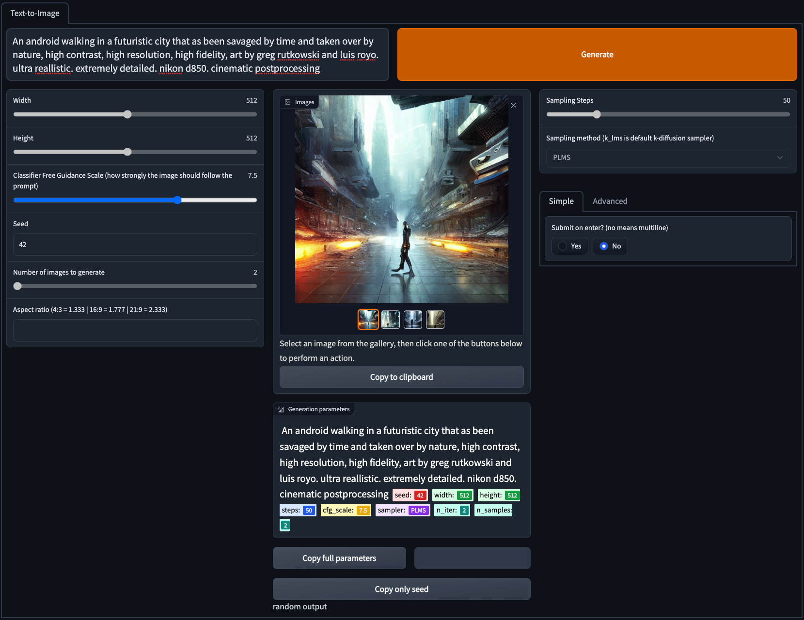

# Serving Diffusion UI

## Setup

**Note** I added an auth layer, which you can change or remove. It is located at the end of the file `webui_playground.py`, in `demo.launch()` method.

1. Build the image

    ```bash
    docker build . --build-arg port=80 --build-arg aip_endpoint_name=projects/{project_id}/locations/us-central1/endpoints/{endpoint_id} -t gcr.io/jfacevedo-demos/serving-diffusion-ui:latest
    ```
1. Push image to GCR

    ```bash
    docker push gcr.io/{project_id}/serving-diffusion-ui:latest
    ```
1. Deploy image to cloud run

    ```bash
    gcloud run deploy --port 80 --region us-central1 serving-diffusion-ui --image gcr.io/{project_id}/serving-diffusion-ui:latest
    ```

    When this is deployed, you'll get a URL where you can access the webui. Make the url public by following [this link](https://cloud.google.com/run/docs/securing/managing-access#making_a_service_public)

1. You might have organizational policies that don't allow public internet to access your instance. If that's the case, add Domain restricted sharing to `All`. Be aware this can create a security loophole. 